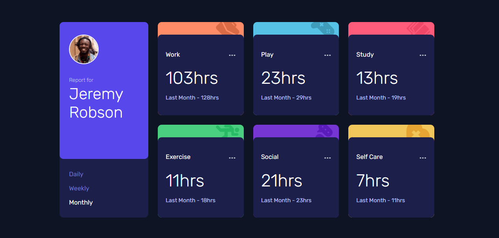

# Frontend Mentor - Time tracking dashboard solution

This is a solution to the [Time tracking dashboard challenge on Frontend Mentor](https://www.frontendmentor.io/challenges/time-tracking-dashboard-UIQ7167Jw).

## Table of contents

- [Overview](#overview)
  - [The challenge](#the-challenge)
  - [Screenshot](#screenshot)
  - [Links](#links)
- [My process](#my-process)
  - [Built with](#built-with)
  - [What I learned](#what-i-learned)
  - [Continued development](#continued-development)
  - [Useful resources](#useful-resources)

**Note: Delete this note and update the table of contents based on what sections you keep.**

## Overview

### The challenge

Users should be able to:

- View the optimal layout for the site depending on their device's screen size
- See hover states for all interactive elements on the page
- Switch between viewing Daily, Weekly, and Monthly stats

### Screenshot

### Links

- [Solution URL](https://www.frontendmentor.io/solutions/time-tracking-dashboard-using-htmlcss-js-asyncawait-and-transition-d1kL5GKaT)
- [Live Site URL](https://mohsin316.github.io/Time-tracking-dashboard/)

## My process

### Built with

- Semantic HTML5 markup
- CSS custom properties
- Flexbox
- CSS Grid
- Mobile-first workflow
- Async and Awaint functions
- various transitions and animations
- getting data from .json file 

### What I learned

I learnt a great amount from getting data from a .json file and accessing it using async and await. Getting the animation for the fade in and fade out of the data thats displayed as the user clicks on either daily, weekly, or monthly was fairly challenging but I figured out a way in the end and it came out exactly as i had hoped. Super proud of that!

### Continued development

For future plans for now its to do more and more javascript. I just recently finished a course for it and i want to use my new hand skills and make amazing projects. super glad font end mentor exists. After playing around with Js i might study a framework or start a little bit on the backend. In fact i was considering looking up a few videos on using Figma and learn how to design proper websites.

### Useful resources

- [Example resource 1](https://netninja.dev/courses) - This helped me for Studying javascript. I really liked this course and i highly recommend to begginers.
